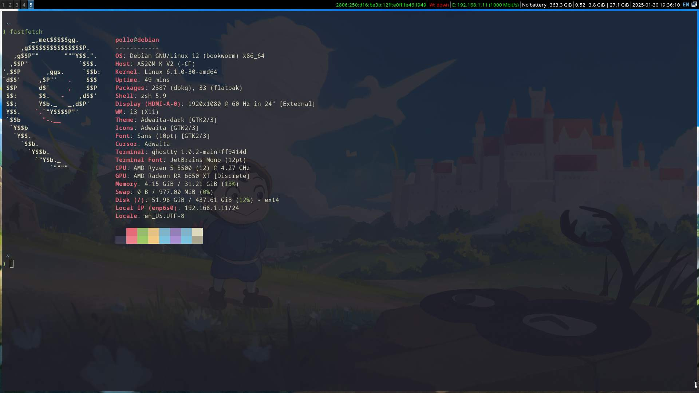

# Config files

This repository contains the configuration files for various tools and applications that I use to create a productive and aesthetically pleasing desktop environment.

## Tools

- NeoVim
- i3
- Polybar
- Rofi
- Picom
- Alacritty
- zsh
